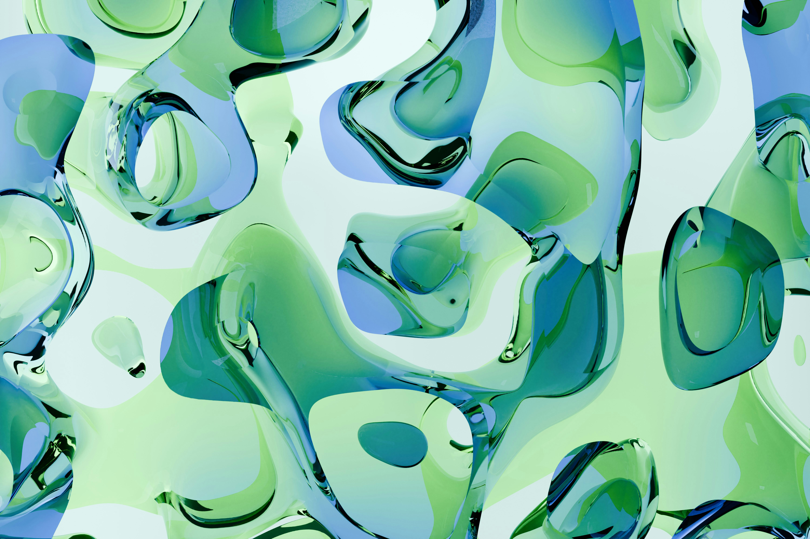
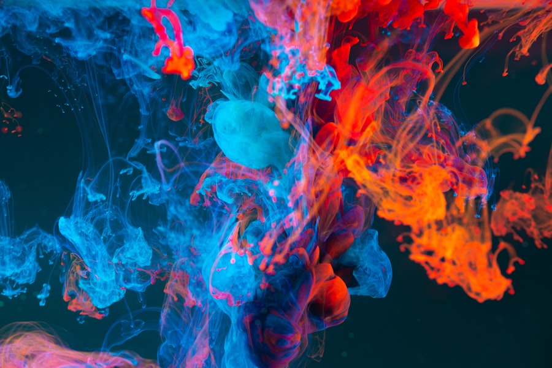

# Quiz 8

## Part 1: Imaging Technique Inspiration

I was inspired by the flowing color motion often used in digital art and interactive installations.  
This imaging technique blends multiple colors that smoothly change and move, creating the feeling of liquid or energy in motion.  
I want to use this visual style in my project to make a calm, organic background that feels alive and responsive.  
It is beneficial because it adds emotion and movement to the design without using complex shapes or heavy animation.

---

## Part 2: Coding Technique Exploration

To recreate the smooth and flowing color transitions from Part 1,  
I explored the **Perlin Noise** function in p5.js.  
By applying `noise()` to control the color blending over time,  
the colors shift gradually, creating a natural liquid-like motion.  
This coding technique is simple but powerful, and it helps me  
generate dynamic and organic visuals that fit the calm mood of my project.  

